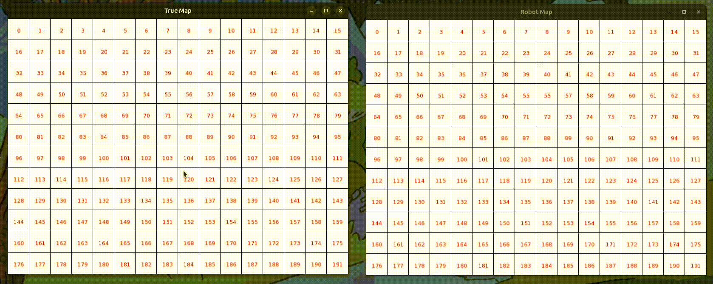

# 🤖 Robot Pathfinding Simulation



A C++ project simulating a robot navigating a grid-based map using Dijkstra's algorithm. Built with **SFML** for visualization, this project allows interactive placement of the start, goal, and obstacles, and shows how a robot can build and use a local map to navigate.

---

## 🧠 Features

- 📦 Grid-based tile map
- 🚧 Interactive obstacle placement
- 🟢 Start and 🏁 goal tile selection
- 📡 Simulated sensors (up/down/left/right) for obstacle detection
- 📍 Local robot map (limited view)
- 🧭 Dijkstra’s shortest path algorithm
- 🎮 Real-time visualization with SFML
- 🖥️ Dual window interface: real map vs robot's local map

---

## 🕹️ How to Use

1. **Run the program**  
2. **Left-click** to:
   - First click: set **start tile**
   - Second click: set **goal tile**
   - Following clicks: place **obstacles**
3. **Right-click** on an obstacle tile to remove it
4. Press **E** to:
   - Build the graph
   - Compute the shortest path
   - Start the robot's navigation

---

## 📷 Interface Overview

- **Window 1**: full map with start, goal, and obstacles
- **Window 2**: robot’s local map based on sensor detection

---

## 🛠️ Technologies

- **C++17**
- **SFML 2.6+**
- **Doxygen** (for documentation)


## 📂 Project Structure
```plaintext
├── src/ # Source files (.cpp)
├── include/ # Header files (.h)
├── README.md # This file
└── documentation/html
```


## 📑 Documentation

The generated documentation is available in the `docs/html/` folder. 
You can browse it by opening `docs/html/index.html` locally after cloning the repo.

## 🛠️ Build Instructions

This project uses **CMake** for building.  
Make sure you have installed:

- A C++17 compatible compiler (e.g., g++ or clang++)
- [SFML 2.6+](https://www.sfml-dev.org/)
- CMake 3.10 or newer

### 🔧 Build steps (Linux/macOS)

```bash
# Create a build directory
mkdir -p build
cd build
```

# Generate Makefiles with CMake
cmake ..

# Compile
make

# Run the executable 
./Robot-tSim


## 📝 License

This project is licensed under the MIT License. See the [LICENSE](LICENSE) file for details.

## 👨‍💻 Author
Marco Caruso 
GitHub: [https://github.com/MarcoCaruso03](https://github.com/MarcoCaruso03)
